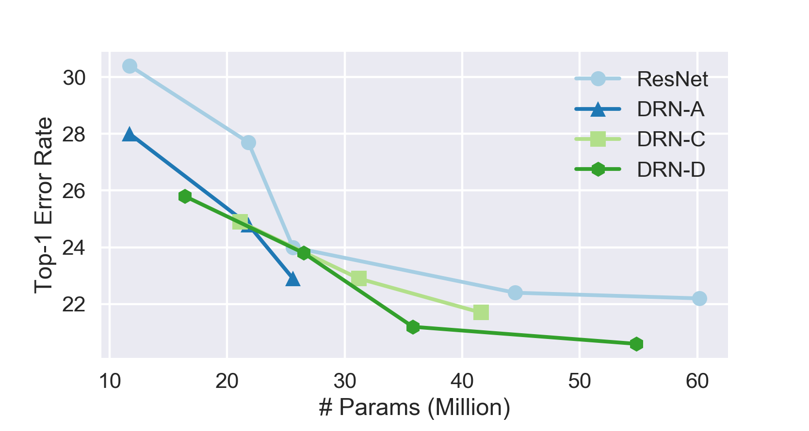

## Overview

This code provides various models combining dilated convolutions with residual networks. Our models can achieve better performance with less parameters than ResNet on [image classification](#image-classification) and [semantic segmentation](#semantic-image-segmentataion).

If you find this code useful for your publications, please consider citing

```
@inproceedings{Yu2017,
    title     = {Dilated Residual Networks},
    author    = {Fisher Yu and Vladlen Koltun and Thomas Funkhouser},
    booktitle = {Computer Vision and Pattern Recognition (CVPR)},
    year      = {2017},
}

@inproceedings{Yu2016,
    title     = {Multi-scale context aggregation by dilated convolutions},
    author    = {Yu, Fisher and Koltun, Vladlen},
    booktitle = {International Conference on Learning Representations (ICLR)},
    year      = {2016}
}
```

## Image Classification

Image classification is meant to be a controlled study to understand the role of high resolution feature maps in image classification and the class activations rising from it. Based on the investigation, we are able to design more efficient networks for learning high-resolution image representation. They have practical usage in semantic image segmentation, as detailed in [image segmentation section](#semantic-image-segmentataion).

### Models

Comparison of classification error rate on ImageNet validation set and numbers of parameters. It is evaluated on single center 224x224 crop from resized images whose shorter side is 256-pixel long.

| Name | Top-1 | Top-5 | Params |
| --- | :---: | :---: | :---: |
| ResNet-18 | 30.4% | 10.8% | 11.7M |
| DRN-A-18 | 28.0% | 9.5% | 11.7M |
| DRN-D-22 | 25.8% | 8.2% |16.4M |
| DRN-C-26 | 24.9% | 7.6% |21.1M |
| ResNet-34 | 27.7% | 8.7% | 21.8M |
| DRN-A-34 | 24.8% | 7.5% | 21.8M|
| DRN-D-38 | 23.8% | 6.9% |26.5M |
| DRN-C-42 | 22.9% | 6.6% |31.2M |
| ResNet-50 | 24.0% | 7.0% | 25.6M |
| DRN-A-50 | 22.9% | 6.6% | 25.6M |
| DRN-D-54 | 21.2% | 5.9% | 35.8M |
| DRN-C-58 | 21.7% | 6.0% | 41.6M |
| ResNet-101 | 22.4% | 6.2% | 44.5M |
| DRN-D-105 |  20.6% | 5.5% | 54.8M |
| ResNet-152 | 22.2% | 6.2% | 60.2M |

The figure below groups the parameter and error rate comparison based on netwok structures.




### Training and Testing

The code is written in Python. Software dependency:

* Python 3
* Pillow
* pytorch
* torchvision

**Note** If you want to train your own semantic segmentation model, make sure your Pytorch version is greater than [0.2.0](https://github.com/pytorch/pytorch/releases) or includes commit [78020a](https://github.com/pytorch/pytorch/pull/2077/commits/78020a52abb76fcb1c344b3c42fbe8610cc387e4).

Go to [this page](https://github.com/facebook/fb.resnet.torch/blob/master/INSTALL.md#download-the-imagenet-dataset) to prepare ImageNet 1K data.

To test a model on ImageNet validation set:
```
python3 classify.py test --arch drn_c_26 -j 4 <imagenet dir> --pretrained
```

To train a new model:
```
python3 classify.py train --arch drn_c_26 -j 8 <imagenet dir> --epochs 120
```

Besides `drn_c_26`, we also provide `drn_c_42` and `drn_c_58`. They are in DRN-C family as described in [Dilated Residual Networks](https://umich.app.box.com/v/drn). DRN-D models are simplified versions of DRN-C. Their code names are `drn_d_22`, `drn_d_38`, `drn_d_54`, and `drn_d_105`.

## Semantic Image Segmentataion

### Models

Comparison of mIoU on Cityscapes and numbers of parameters.

| Name | mIoU | Params |
| --- | :---: | :---: |
| DRN-A-50 | 67.3% | 25.6M |
| DRN-C-26 | 68.0% | 21.1M |
| DRN-C-42 | 70.9% | 31.2M |
| DRN-D-22 | 68.0% | 16.4M |
| DRN-D-38 | 71.4% | 26.5M |

### Prepare Data

The segmentation image data folder is supposed to contain following image lists with names below:

* train_images.txt
* train_labels.txt
* val_images.txt
* val_labels.txt
* test_images.txt

The code will also look for `info.json` in the folder. It contains mean and std of the training images. For example, below is `info.json` used for training on Cityscapes.

```
{
    "mean": [
        0.290101,
        0.328081,
        0.286964
    ],
    "std": [
        0.182954,
        0.186566,
        0.184475
    ]
}
```

Each line in the list is a path to an input image or its label map relative to the segmentation folder.

For example, if the data folder is "/foo/bar" and train_images.txt in it contains
```
leftImg8bit/train/aachen/aachen_000000_000019_leftImg8bit.png
leftImg8bit/train/aachen/aachen_000001_000019_leftImg8bit.png
```
and train_labels.txt contrains
```
gtFine/train/aachen/aachen_000000_000019_gtFine_trainIds.png
gtFine/train/aachen/aachen_000001_000019_gtFine_trainIds.png
```
Then the first image path is expected at
```
/foo/bar/leftImg8bit/train/aachen/aachen_000000_000019_leftImg8bit.png
```
and its label map is at
```
/foo/bar/gtFine/train/aachen/aachen_000000_000019_gtFine_trainIds.png
```

In training phase, both train_\* and val_\* are assumed to be in the data folder. In validation phase, only val_images.txt and val_labels.txt are needed. In testing phase, when there are no available labels, only test_images.txt is needed. `segment.py` has a command line option `--phase` and the corresponding acceptable arguments are `train`, `val`, and `test`.

### Optimization Setup

The current segmentation models are trained on basic data augmentation (random crops + flips). The learning rate is changed by steps, where it is decreased by a factor of 10 at each step.

### Training

To train a new model, use
```
python3 segment.py train -d <data_folder> -c <category_number> -s 896 \
    --arch drn_d_22 --batch-size 8 --epochs 250 --lr 0.001 --momentum 0.99 \
    --step 100
```

`category_number` is the number of categories in segmentation. It is 19 for Cityscapes and 11 for Camvid. The actual label maps should contain values in the range of `[0, category_number)`.

### Testing

Evaluate models on testing set or any images without ground truth labels using our related pretrained model:
```
python3 segment.py test -d <data_folder> -c <category_number> --arch drn_d_22 \
    --pretrained <model_path> --phase test --batch-size 1
```

You can download the pretrained DRN models on Cityscapes here: http://go.yf.io/drn-cityscapes-models.

If you want to evaluate a checkpoint from your own training, use `--resume` instead of `--pretrained`:
```
python3 segment.py test -d <data_folder> -c <category_number> --arch drn_d_22 \
    --resume <model_path> --phase test --batch-size 1
```
